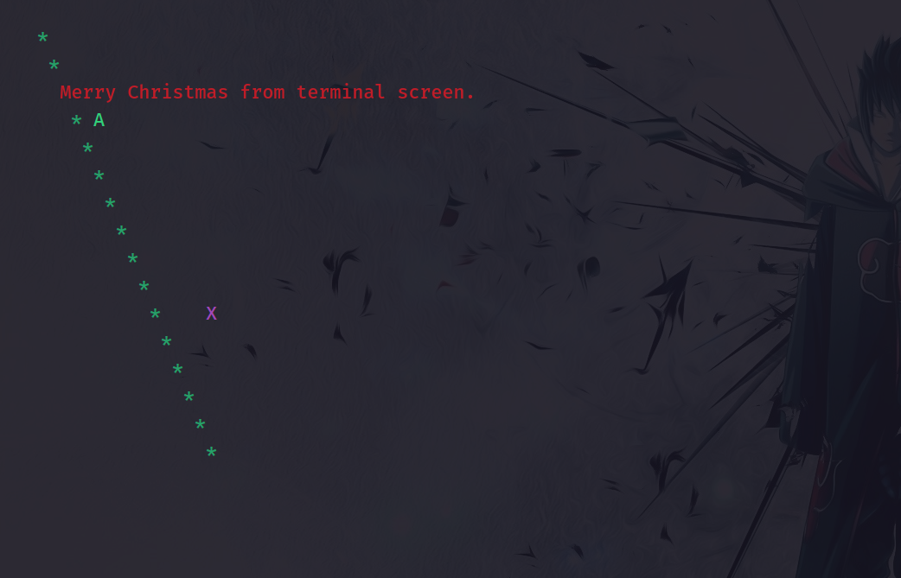
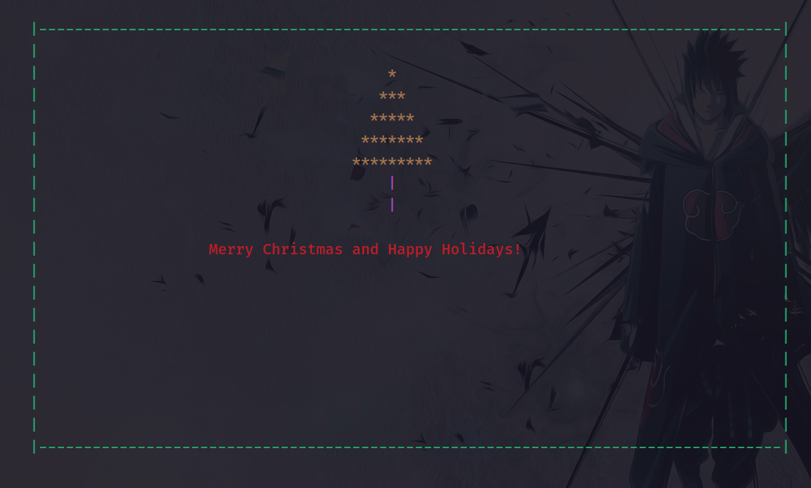
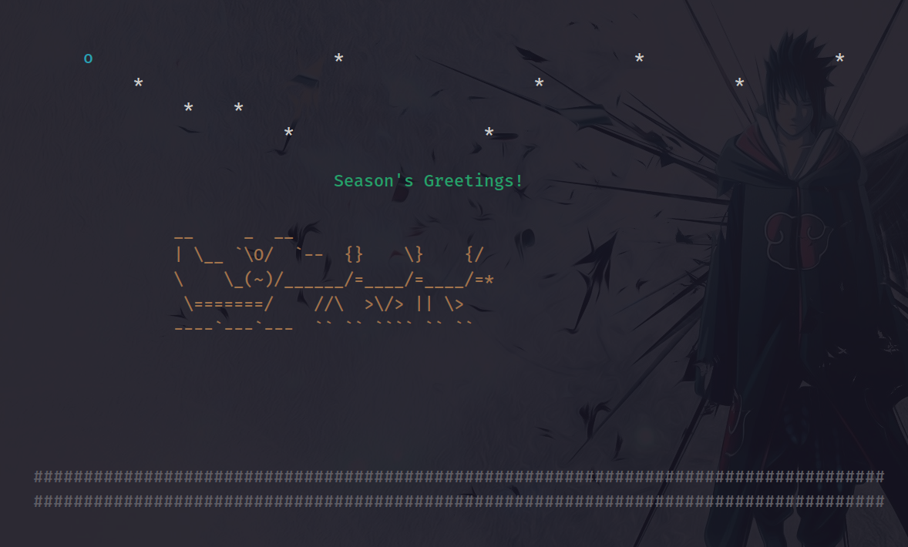
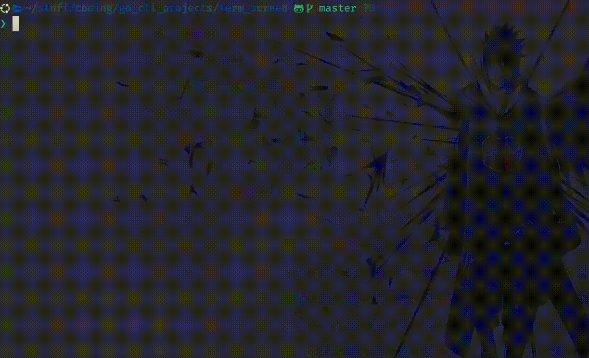

# Term Screen

## Usage
```bash
# clone repo
git clone https://github.com/MwauratheAlex/term_screen.git
cd term_screen

# Build the binary
go build -o term main.go
# Run
# input.bin generated by 'make_stream.py'
# you can use any other binary stream as long as it conforms to specifications
./term < input.bin
# input.txt is assumed to be a file containing commands
```

## Examples
### Basic testing binary
```bash
./term < examples/input.bin
```


### Christmas
```bash
./term < examples/xmas.bin
```


### Santa
```bash
./term < examples/santa.bin
```


### Animated Santa
- I added a delay command
```bash
[0x08, 0x00]
```
- The above byte sequence will delay for 1 millisecond
- Of course we could have specified the time in the command itself,
but that's for later.
- Here is an animated example.
```bash
./term < examples/animated_santa.bin
```



The binary generating scripts were mainly done with chatgpt.
Have fun.

## Specifications
Imagine a stream of bytes supplied to a program to render them is a screen
inside a terminal.

Below is the defination of the binary format used for communication between a 
computer and the screen:

```bash
+--------------+----------------+-------------+-------------+-----+---------------+
| Command Byte | Length of Byte | Data Byte 0 | Data Byte 1 | ... | Data Byte n-1 |
+--------------+----------------+-------------+-------------+-----+---------------+
```
The data format is an array of bytes, containing sections of above form, in
succession. Each section begins with a command byte, specifying type of operation
to be performed on the screen, followed by a length byte, and then a sequence of
of data bytes, which function as arguements to the command as specified below:

- 0x1 - Screen setup: Defines the dimensions and color setting of the screen.
The screen must be setup before any command is sent. Commands are ignored if the 
screen hasn't been setup.

Data format:
Byte 0: Screen Width (in characters)
Byte 1: Screen Height (in characters) 
Byte 2: Color Mode (0x00 for monochrome, 0x01 for 16 colors, 0x02 for 256 colors)

- 0x2 – Draw character: Places a character at a given coordinate of the screen.
Data format:
Byte 0: x coordinate 
Byte 1: y coordinate 
Byte 2: Color index 
Byte 3: Character to display (ASCII)

- 0x3 – Draw line: Draws a line from one coordinate of the screen to another.
Data format:
Byte 0: x1 (starting coordinate) 
Byte 1: y1 (starting coordinate) 
Byte 2: x2 (ending coordinate) 
Byte 3: y2 (ending coordinate) 
Byte 4: Color index 
Byte 5: Character to use (ASCII)

- 0x4 – Render text: Renders a string starting from a specific position.
Data format:
Byte 0: x coordinate 
Byte 1: y coordinate 
Byte 2: Color index 
Byte 3-n: Text data (ASCII characters)

- 0x5 – Cursor movement: Moves cursor to a specific location without drawing on the screen.
Data format:
Byte 0: x coordinate 
Byte 1: y coordinate

- 0x6 – Draw at cursor: Draws a character at the cursor location.
Data format:
Byte 0: Character to draw (ASCII) 
Byte 1: Color index

- 0x7 – Clear screen:
Data format: No additional data.

- 0xFF – End of file: Marks the end of binary stream.
Data format: No additional data.

The program should draw the screen from within a terminal window, 
but the question of whether to do so inside the terminal from which it is launched
or to launch a separate terminal window is left to the implementer.

